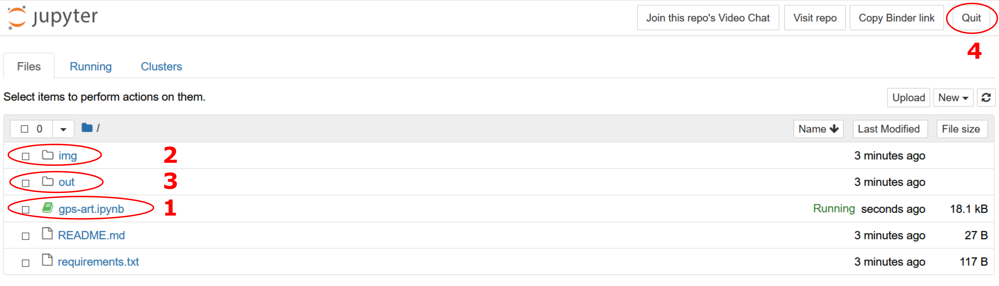

# GPS Art Jupyter Notebook

Here is the code I wrote for my runs during the GRGR2020 event. If you want to have a play with the code (and know what you are doing with jupyter notebooks) just click the Binder link below.

If you are a little unsure on what to do hopefully the simple instructions below will help:

<ol>
    <li>
        Click the 'Launch Binder@ button below and a webpage similar to the image below should open.
        
    </li>
    <li>
        In the image above, clicking on option 1 will take you to the juypter notebook code, option 2 is where the input line drawings are stored, option 3 is where the output GPX file should be created and option 4 is the quit button.
    </li>
    <li>
        Once you have selected the notebook (option 1), scroll down and have a read. When you get to the code sections, click in the box and hit shift + enter to run the code from a computer or on a mobile device there should be a button with a triangle-line symbol you can use (note it is not really designed for mobile use).
    </li>
    <li>
        Keep going through and eventually you'll get to a bit of code that outputs the GPX route file. This will be output to the ouput file, option 3 in the first image. You can then navigate to this and download it.
    </li>
    <li>
        If you are feeling brave or creative, you can upload a DXF file (created as explained in the opening section of the notebook) to the img (option 2 above) folder and build your own route!
    </li>
</ol>

So what are you waiting for... give it a go, click the button!

